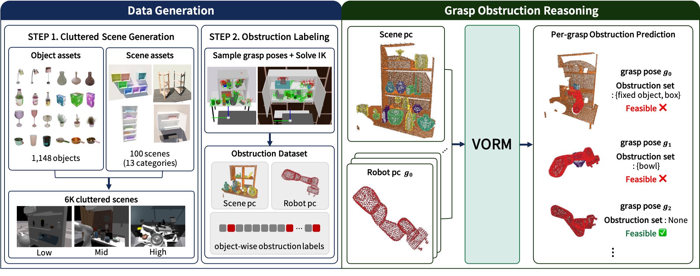
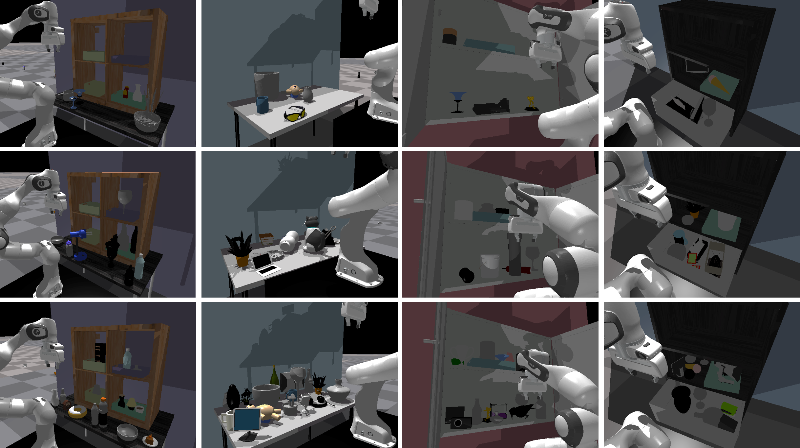
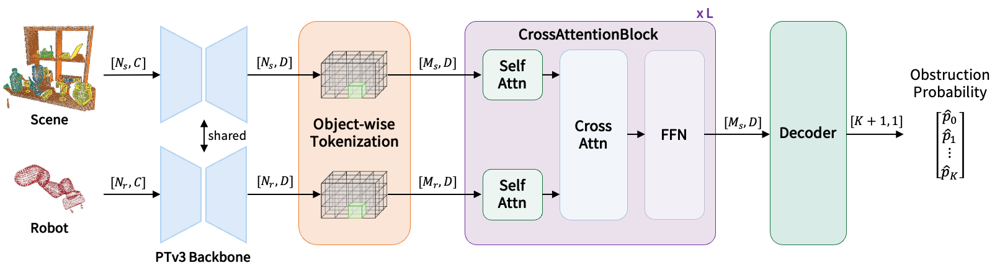

<!--
Real authors / affiliations 

authors: >
      <span class="author-name">Hyojeong Kim</span><sup>1,2,*</sup>,
      <span class="author-name">Minji Kim</span><sup>1,3,*</sup>,
      <span class="author-name">Junhwa Lee</span><sup>1</sup>,
      <span class="author-name">Myo-Taeg Lim</span><sup>2</sup>,
      <span class="author-name">Yoonseon Oh</span><sup>3</sup>,
      <span class="author-name">ChangHwan Kim</span><sup>1,&dagger;</sup>
affiliations: >
      <sup>1</sup>Korea Institute of Science and Technology,
      <sup>2</sup>Korea University,
      <sup>3</sup>Hanyang University
      <br><sup>*</sup>Equal Contribution &nbsp; <sup>&dagger;</sup>Corresponding Author
-->

<!-- Using HTML to center the abstract -->
<div class="columns is-centered has-text-centered">
    <div class="column is-four-fifths">
        <h2>Abstract</h2>
        <div class="content has-text-justified">
In cluttered environments, grasping a target object often requires relocating surrounding obstacles, but identifying which objects to remove is challenging: the obstacles depend on the chosen SE(3) grasp pose and the robot's full embodiment, and many regions are occluded under partial observation. We address this with grasp obstruction reasoning---predicting which objects collide with the robot at a target grasp---and propose Volumetric Obstruction Reasoner for Manipulators (VORM). VORM performs object-wise obstruction prediction by jointly reasoning over point clouds of the segmented scene and the manipulator's full arm-gripper volume, with cross-attention modeling their local geometric relation at the target grasp. To train VORM, we build a procedural pipeline on top of FetchBench that generates cluttered scenes at three clutter levels and annotates per-grasp obstruction labels. VORM outperforms baselines on obstruction and feasibility reasoning in highly cluttered, partially observed scenes and improves success rates on target-retrieval tasks.
        </div>
    </div>
</div>

---

<p></p>
<p><em>VORM overview. (Left) We procedurally generate 6K cluttered scenes and annotate object-wise collision labels. (Right) Given a segmented scene point cloud and a robot point cloud induced by a grasp pose, VORM predicts the obstruction set; for the same scene, different grasps yield different obstruction sets and feasibility outcomes. In each prediction, only the robot and predicted obstructing objects are rendered.</em></p>


> **Why Obstruction Reasoning?** \
> When the target is obstructed by surrounding objects, some of them should be relocated first to enable a collision-free grasp—yet the obstacles to be removed are tightly coupled with how the target is grasped, and depend on the robot's embodiment and configuration. VORM performs object-wise obstruction prediction, determining which surrounding objects collide with the robot at a grasp pose, for arbitrary SE(3) grasps. 

<!-- ## Dataset Generation
<p></p>

We build a FetchBench-based simulation dataset for grasp obstruction reasoning, spanning 1,148 objects and 13 categories of procedural scenes. Cluttered scenes are generated at three levels—low, medium, and high—parameterized by occupancy rate, yielding 6Kcluttered scenes in total. For each scene, we sample candidate grasps, solve inverse kinematics with cuRobo, and use FCL collision checking to annotate object-wise obstruction labels, resulting in 687K grasp configurations. Each sample contains a segmented scene point cloud, a robot point cloud induced by a grasp, and per-object obstruction labels. -->

## Network Architecture
<p></p>

VORM takes two point-cloud inputs: the segmented scene and the robot occupancy induced by a candidate grasp.
Both point clouds are encoded with a shared PTv3 backbone. Object-wise voxel tokens are then constructed to preserve local geometry and object identity. Finally, cross-attention between scene tokens and robot tokens models their geometric interaction and predicts obstruction probabilities for each object.

## Experiments

### Quantitative Result
We evaluate VORM on two tasks: obstruction reasoning and feasibility reasoning. Obstruction reasoning determines whether the robot collides with each object in the scene, whereas feasibility reasoning determines whether it collides with none. VORM achieves the highest F1 on both tasks across all clutter levels.

##### Obstruction Reasoning

| Method | Precision | Recall | F1 | Low F1* | Mid F1* | High F1* |
|--------|-----------|--------|----|---------|---------|----------|
| **VORM (Ours)** | **0.921** | 0.911 | **0.923** | **0.935** | **0.923** | **0.912** |
| MC+FCL | 0.721 | **0.931** | 0.813 | 0.827 | 0.815 | 0.805 |
| GRN | 0.449 | 0.241 | 0.314 | 0.316 | 0.321 | 0.305 |

##### Feasibility Reasoning

| Method | Precision | Recall | F1 | Low F1* | Mid F1* | High F1* |
|--------|-----------|--------|----|---------|---------|----------|
| **VORM (Ours)** | 0.933 | **0.912** | **0.923** | **0.933** | **0.922** | **0.913** |
| MC+FCL | **0.965** | 0.372 | 0.537 | 0.511 | 0.540 | 0.557 |
| GRN | 0.310 | 0.391 | 0.346 | 0.327 | 0.350 | 0.355 |
| CabiNet | 0.401 | 0.219 | 0.283 | 0.323 | 0.279 | 0.251 |

VORM achieves the highest F1 on both obstruction and feasibility reasoning across all clutter levels. The results show that VORM not only predicts object-wise obstruction accurately, but also preserves this accuracy when object-wise predictions are aggregated into grasp-level feasibility.

### Simulation Result
<!-- <p></p> -->
<!-- <video controls width="100%">
  <source src="figure/target_retrieval.mp4" type="video/mp4">
</video> -->

<div class="vorm-viewer">
  <!-- 버튼: 전부 한 열로 쌓임 -->
  <div class="vorm-controls">
    <div id="vorm-scene-group"></div>
  </div>

  <!-- 영상 표시 영역 -->
  <div class="vorm-stage">
    <video id="vorm-video" autoplay muted loop playsinline controls preload="metadata"></video>
  </div>
</div>

<script>
(function(){
  // ---- 설정 (여기만 수정하면 됩니다) -------------------------------
  var BASE = "video/";           // 영상들이 들어있는 폴더 경로

  // scene 버튼 목록: 버튼 하나당 { label: 표시이름, file: 영상파일이름 }
  // label = 버튼에 보이는 글자, file = BASE 폴더 안의 mp4 파일 이름
  var scenes = [
    { label:"CellShelfDesk",     file:"CellShelfDesk.mp4" },
    { label:"Desk",              file:"Desk.mp4" },
    { label:"DoubleDoorCabinet", file:"DoubleDoorCabinet.mp4" },
    { label:"Drawer",            file:"Drawer.mp4" },
    { label:"LargeShelf",        file:"LargeShelf.mp4" },
    
    // 필요한 만큼 줄을 추가하세요:
    // ,{ label:"...", file:"....mp4" }
  ];
  // -----------------------------------------------------------------

  var state = { index: 0 };
  var sceneGroup = document.getElementById("vorm-scene-group");
  var video      = document.getElementById("vorm-video");

  function makeBtn(text, onClick){
    var b = document.createElement("button");
    b.className = "vorm-btn";
    b.textContent = text;
    b.addEventListener("click", onClick);
    return b;
  }
  function loadVideo(){
    video.src = BASE + scenes[state.index].file;
    video.load();
    var p = video.play();
    if(p && p.catch){ p.catch(function(){}); }
  }
  function refresh(){
    [].forEach.call(sceneGroup.children, function(b){
      b.classList.toggle("active", +b.dataset.index === state.index);
    });
    loadVideo();
  }

  scenes.forEach(function(s, i){
    var b = makeBtn(s.label, function(){ state.index = i; refresh(); });
    b.dataset.index = i;
    sceneGroup.appendChild(b);
  });

  refresh();
})();
</script>

<!-- We examine how obstruction reasoning quality affects downstream target retrieval, a TAMP problem. In each scene, the target is the object requiring the most removals before being graspable. Each method follows a three-stage pipeline: obstruction reasoning predicts object-wise obstruction for every candidate grasp, relocation planning produces a sequence of objects to grasp with their grasp poses, and execution generates and runs the trajectories with cuRobo. -->

<!-- ## Citation
```
@article{turing1936computable,
  title={On computable numbers, with an application to the Entscheidungsproblem},
  author={Turing, Alan Mathison},
  journal={Journal of Mathematics},
  volume={58},
  number={345-363},
  pages={5},
  year={1936}
}
``` -->
